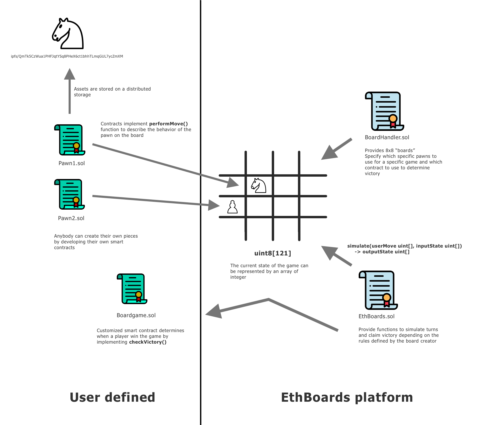
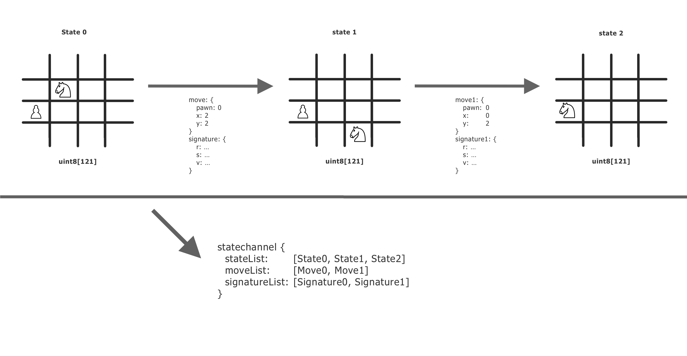

<p align="center">
  
</p>

# Light Paper


### Introduction

Ethboards is a smart contract platform to create generic two players boardgames on Ethereum. The smart contracts provided handle the state of the game and ensure the players play honestly their turn and don't cheat. Otherwise, the rules of the games are determined by custom smart contracts that can be written by anyone.

The rules that can be created are:

- What are the possible actions of the pawn in the game
- How can we determine a player won a game

Next versions will include:

- What is the condition to enter a game
- What actions happen when a player win or lose a game

The vision of this project is to create an ecosystem where people can create games with creative pawns but also creative rules to participates in the game. For example, two players would must lock tokens or a specific asset to participate and the winner wins the locked assets.

Kind of a DeFied boardgames platform!

---

### Smart contract platform

The smart contract platform is composed of two smart contracts:

- [EthBoards](https://github.com/ltacker/ethboards/blob/master/contracts/EthBoards.sol): Game Logic contract. Provide the generic methods to simulate a turn in a game and methods for a user to claim victory

- [BoardHandler](https://github.com/ltacker/ethboards/blob/master/contracts/BoardHandler.sol): Boards Content contract. Store all the information about the boards. For example: what are the different pawns used for a specific board.



### Game

A game is a succession of **game states**. A game state is the representation of the game at a given time, where are placed the remaining pawns in the game. The game state is represented through an array of integers.

Each of these transitions of game state is performed by a **move**. A move defines which pawn the player decides to move, which action of the pawn (determined by its smart contract) is selected and what are the coordinates where the action is performed. The move is represented by an array of integers as well.

Currently, all games are played on an 8x8 boards where the maximum number of pawn is 40.

The game state is represented through an array of 121 integers:

- [0] represents the number of pawns present on the board
- [1:41]: Represent what the type of the pawns in the game. 0 means the pawn has been eliminated.
- [42:81]: Represent the coordinate x of the pawns in the game
- [82:121]: Represent the coordinate y of the pawns in the game

Let's say the board is Chess and the pawn type 2 represents a Black Knight. if gameState[1] == 2, gameState[41] == 5 and gameState[81] == 4, it will mean a Black Knight is currently positioned on coordinates [5,6].

The library [StateController](https://github.com/ltacker/ethboards/blob/master/contracts/StateController.sol) gives utilitary functions to manipulate this state.

A move is represented through an array of 4 integers:

- [0] represents the selected pawn to perform the move
- [1] represents the selected action of the pawn (a pawn smart contract can define several possible actions)
- [2] represents the coordinate x to perform the action
- [3] represents the coordinate y to perform the action

Let's say we're playing chess and the pawn 0 is a Black Knight. It's blacks' turn. The move [0,0,5,5] will move this Black Knight to the coordinates [5,5] (assuming the current state of the game allows this move, this is the Black Knight's smart contract that must verify this condition).

### State channels

This representation of a game as transitions of states allows us to very easily develop a State Channel solution to play games without paying fees (except when entering and claiming victory). A server will store in a database the list of states, moves performed, and signatures of the moves from the players. These data are shared and used when a player wants to claim victory.

[ethboards-statechannels](https://github.com/ltacker/ethboards-statechannels) is an implementation of such a server. It is developed in Go and uses MongoDB to store the State Channels. This server exposes a REST API to the players.




### Custom smart contracts

Boards are pawns are custom smart contracts that defines the rules of a specific game.

#### Boards

A board is a template for a game, this template defines what are the available pawns in the game, what are their original positions on the board and what are the conditions for a player to win the game.

The different boards, where games can be started on, are stored in the BoardHandler contract. The following structure defines a board:

```
struct Board {
  address boardContract;
  address creator;
  bool deployed;
  uint8 pawnTypeNumber;
  uint8 pawnNumber;
  mapping (uint8 => address) pawnTypeAddress;
  mapping (uint8 => PawnPosition) pawnPosition;
  uint gameCount;
  mapping (uint => Game) games;
  address waitingPlayer;
}
```

The board contract is a smart contract that implements the following interface:

```
interface Board {
	 function checkVictory(uint8 player, uint8[121] calldata state) external view returns(bool);
}
```

The function *checkVictory* takes a player, 0 for player A, 1 for player B, and a state of the game and returns true is in this current state the given player is victorious in the game.

This function is called by the EthBoards contract when a player claims victory.

#### Pawns

Pawns are the interactive pieces of a game. Actions are performed to them during a game and this is what provokes the transitions of state.

Pawns are implemented with smart contracts that implement this interface:

```
interface Pawn {
	 function getMetadata() external view returns (string memory);
	 function getMoveNumber() external pure returns(uint8);
	 function performMove(
	    uint8 player,
	    uint8 pawn,
	    uint8 moveType,
	    uint8 x,
	    uint8 y,
	    uint8[121] calldata state
	 ) external pure returns(uint8[121] memory);
}
```
*getMetadata()* returns a link to the metadata resources of the pawns. For example, the name of the pawn or the image of the pawn. These data are too expensive to be stored on Ethereum. To keep a decentralized behavior, we can store these data on a distributed storage solution like IPFS for example.

*getMoveNumber()* returns the number of actions available for the pawn. In the Chess example, the only action available is to move a pawn but, in other games, a pawn could have different actions available like a soldier that could move or shoot enemies.

*performMove()* is the method that defines the state transaction that occurs from the selected pawn, input state, and the selected action. A move is always performed to specific coordinates (x,y). This function must revert if the move is impossible.

The method  *performMove()* is called by the *simulate()* method of the EthBoards contract.

---

### Board example: Simplified Chess

Chess is a perfect example of an implementable game through the platform. Each player must move one piece every turn, each piece has a limited number of possible moves.

For simplification, **Simplified Chess** is a chess game where only the basic moves are authorized. There is no castling for example. Also, to win a game, a player must capture the opponent's king instead of checkmating it. This is because, in a smart contract point of view, it's simpler and cheaper to verify a piece has been captured instead of checking it is checkmated.

Another reason, to implement Simplified rules is that Chess is a good example to show how a game can be implemented, however, it is a bad example for a game that would be played on Mainnet because the game is too vulnerable to CPU. Actual games, with money at stake, on Mainnet, should be computer-resistant, which could be possible to implement with more complex rules, larger boards and randomness features.

#### Pawns

The available pawns are the classic pieces from Chess. The implementations can be [found here](https://github.com/ltacker/ethboards/tree/master/contracts).
The white and the black version of each piece needs a different implementation since it has different rules (a white piece can only be moved by player A, it can only capture black pieces)

Here is the example of the implementation of the white king:

```
pragma solidity 0.5.16;

import "./ChessPawn.sol";
import "../Pawn.sol";
import "../StateController.sol";

contract WhiteKing is Pawn, ChessPawn {
    using StateController for uint8[121];

    function getMetadata() external view returns (string memory etadata) {
        return '/ipfs/QmPzogdBcwRo5Lm81R65LW5gweonwFMaphBjYpQk6PxJWV';
    }
    function getMoveNumber() external pure returns(uint8) {
        return 1;
    }

    function performMove(
        uint8 player,
        uint8 pawn,
        uint8 moveType,
        uint8 x,
        uint8 y,
        uint8[121] calldata state
    ) external pure returns(uint8[121] memory outState) {
        require(moveType == 0, "Pawn contains only one move");
        require(!isFoe(state, player, pawn), "Player can't move a white pawn");
        require(x<8 || y<8, "Move out of bound");

        // Get old positions
        (uint8 oldX, uint8 oldY) = state.getPawnPosition(pawn);
        require(x!=oldX || y!=oldY, "Must be a different position");
        require(
            abs(int8(x)-int8(oldX)) < 2 && abs(int8(y)-int8(oldY)) < 2,
            "Can only move to a next box"
        );

        // If a foe is present in the destination, kill it
        int8 presentPawn = state.getPawnAt(x, y);
        if (presentPawn != -1) {
            require(isFoe(state, player, uint8(presentPawn)), "The pawn present is not a foe");
            outState = state.removePawn(uint8(presentPawn));
            outState = outState.movePawn(pawn, x, y);
        } else {
            outState = state.movePawn(pawn, x, y);
        }

        return outState;
    }
}
```

#### Board

The board contract must implement the function that determines if a player won the game. For the Simplified Chess rules, this is fairly simple, we only have to check if the black king has been captured (player A) won or the white king has been captured (player B won).

The implementation of the contract function is as follows:

```

pragma solidity 0.5.16;

import "../Board.sol";
import "../StateController.sol";

contract ChessBoard is Board {
    using StateController for uint8[121];

    // This is no real chess, we check if the king has been killed to determine the victory
    function checkVictory(uint8 player, uint8[121] calldata state) external view returns(bool) {
        if (player == 0) {
            // The player is A therefore the black king must be kill
            return !state.isAlive(1);
        } else {
            // White king must be killed
            return !state.isAlive(0);
        }
    }
}
```

Every board that use the Simplified Chess contract must append the white king and the black king as first in the board (so that the white king has index 0 and the black king has index 1 when checking if captured)

---

### Further development

- Time out capability when a player stop playing and block the game.
- Randomness