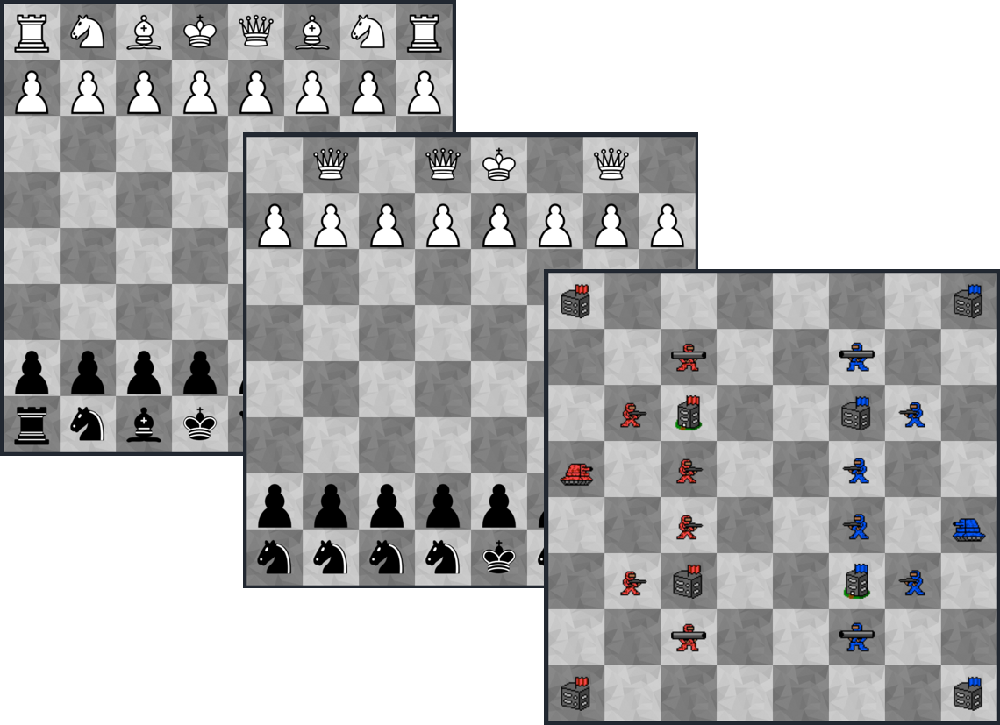

  

# ethboards

Ethboards is a smart contract platform to create generic two players boardgames on Ethereum. The smart contracts provided handle the state of the game and ensure the players play honestly their turn and don't cheat. Otherwise, the rules of the games are determined by custom smart contracts that can be written by anyone.

The rules that can be created are:

- What are the possible actions of the pawn in the game
- How can we determine a player won a game
- What is the condition to enter a game
- What actions happen when a player win or lose a game

The vision of this project is to create an ecosystem where people can create games with creative game rules and logics but also creative rules to participate in the game. For example, two players would must lock tokens or a specific asset to participate and the winner wins the locked assets.

Kind of a DeFied boardgames platform!

## Smart contract platform

The smart contract platform provides smart contracts to handle 8x8 boards and simulate game turns that occur on this board.
The user provides his own smart contracts that determine the pawn's behavior in the game. He also provides a smart contract that determines when a player wins the game.

**The smart contract platform is composed of two smart contracts:**

- [EthBoards](https://github.com/ltacker/ethboards/blob/master/contracts/EthBoards.sol): Game Logic contract. Provide the generic methods to simulate a turn in a game and methods for a user to claim victory

- [BoardHandler](https://github.com/ltacker/ethboards/blob/master/contracts/BoardHandler.sol): Boards Content contract. Store all the information about the boards. For example: what are the different pawns used for a specific board.

**The interfaces of the customizable smart contracts are:**

- [Boards](https://github.com/ltacker/ethboards/blob/master/contracts/Board.sol): The board's smart contract contains a function to check victory in the game and get metadata.

- [Pawns](https://github.com/ltacker/ethboards/blob/master/contracts/Pawn.sol): The pawn's smart contract contains the functions describe the pawn behavior and metadata.

- [BoardEvents](https://github.com/ltacker/ethboards/blob/master/contracts/BoardEvents.sol): The board events contract contains actions that are called when a player win or lose a game and condition to join a game.

## More info here: [Light Paper](https://github.com/ltacker/ethboards/blob/master/LightPaper.md)